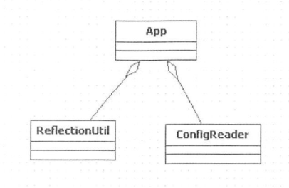
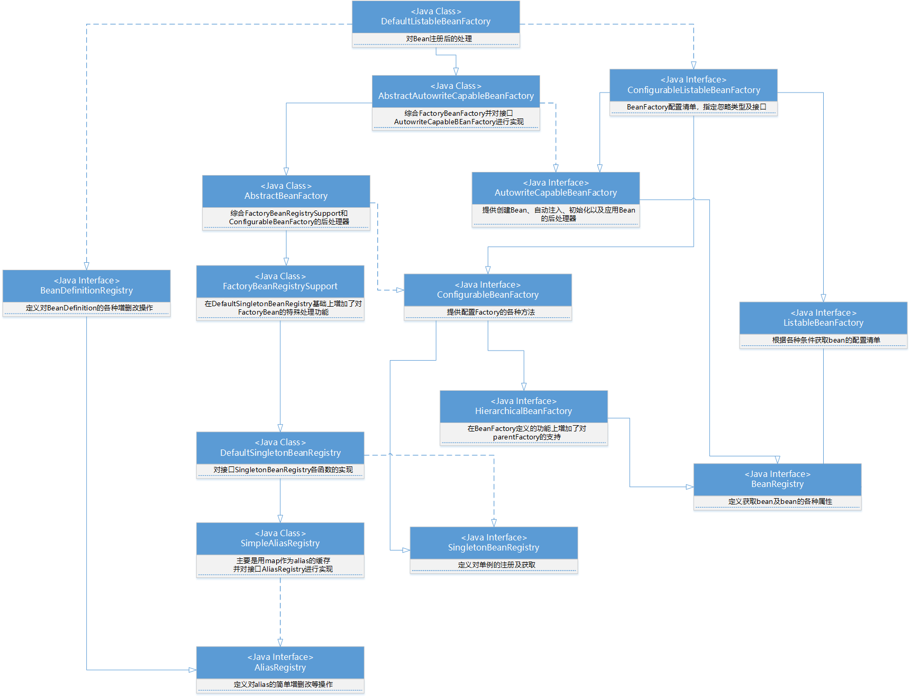

# 容器的基本实现

## 1、容器的基本用法

从一个简单demo入手：

> 创建一个Spring应用
>
> 编写一个Bean
>
> 编写xml文件
>
> 编写test类进行测试

由于上述简单demo过于简单，此处仅仅贴代码就Ok了

```java
public class DemoBean{
    private String str="hello world";
    
    public String getStr(){
        return str;
    }
    
    public void setStr(String str){
        this.str=str;
    }
}
```

```xml
<?xml version="1.0" encoding="UTF-8"?>
<beans xmlns="http://www.springframework.org/schema/beans"
       xmlns:xsi="http://www.w3.org/2001/XMLSchema-instance"
       xsi:schemaLocation="http://www.springframework.org/schema/beans http://www.springframework.org/schema/beans/spring-beans.xsd">
	<bean id="DemoBean" class="com.pang.learning.bean.DemoBean"/>
</beans>
```

```java
public class DemoTest{
    public static void main(String...args){
        BeanFactory bf=new XmlBeanFactory(new ClassPathResource("demoBeanFactory.xml"));
        DemoBean bean=(DemoBean) bf.getBean("DemoBean");
        System.out.println(bean.getStr());
    }
}
```

执行之后会输出`hello world`。

然后后面会从这里一步一步向下解析。。。

## 2、功能分析

执行步骤：

1. 读取配置文件 *demoBeanFactory.xml*
2. 根据配置文件中的配置找到对应的类的配置，并实例化
3. 调用实例化后的实例

简单模拟上述三步的设计类图：



其中：

- ConfigReader负责读取以及验证配置文件。
- ReflectionUtil负责根据配置文件进行反射实例化
- App完成整个逻辑的串联

## 3、Spring的结构组成

### 3.1 beans包的层级结构

- src/main/java    用于展现Spring的主要逻辑
- src/main/resources    用于存放系统的配置文件
- src/test/java    用于对主要逻辑进行单元测试
- src/test/resources    用于存放测试用的配置文件

上面的层级目录和maven的层级目录是一致的。

### 3.2 核心类介绍



