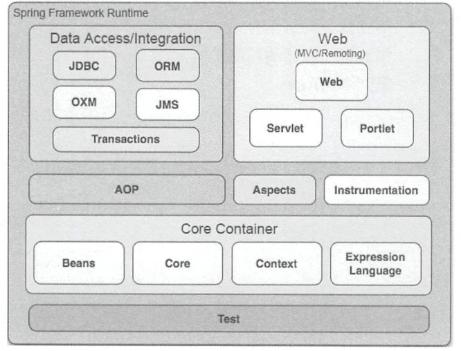

# Spring整体架构

## 1、Spring架构图

## 2、各部分解释

### 2.1 Core Container（核心容器）

核心容器包括了Beans、Core、Context和Expression Language模块。

其中Core和Beans是框架的基础部分，提供了IoC（控制反转）和依赖注入特性。

Context（上下文），大概就是Spring的运行环境，继承Beans的特性，为Spring核心提供了大量扩展。

Expression Language不太清楚什么意思….

### 2.2 Data Access/Integration（数据访问/集成）

JDBC包含了Spring对JDBC数据访问进行封装的所有类。

ORM（对象关系映射）：利用ORM封装包，可以混合使用所有的Spring提供的特性进行O/R映射。

OXM：提供了Object/XML的映射实现抽象层

JMS(Java Messaging Service)和Transaction不太明白啥意思。。。。

### 2.3 Web

首先，Web上下文（Context）模块建立在应用程序上下文（ApplicationContext）之上，为基础Web的应用程序提供了上下文。

Web模块还简化了处理大部分请求以及将请求参数绑定到域对象的工作。

Web模块：提供了基础的面向Web的集成特性。

Web-Servlet模块：包含Spring的MVC实现。

Web-Prolet模块：不太明白。。。

### 2.4 AOP（面向切面编程）

AOP模块提供了一个符号AOP联盟彼岸准的面向切面编程的实现。

### 2.5 Test（测试）

Test模块支持使用JUnit和TestNG对Spring组件进行测试。

## 3、自绘解释图

